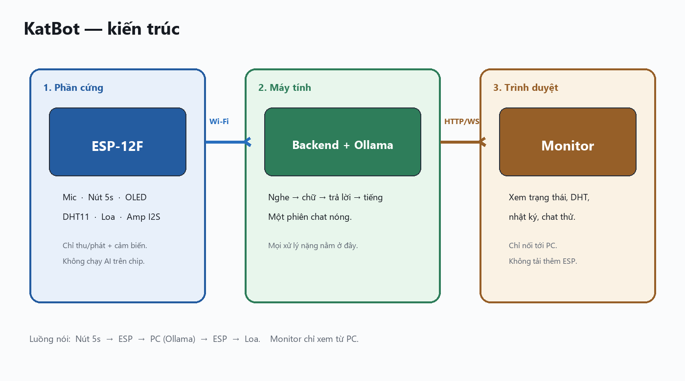
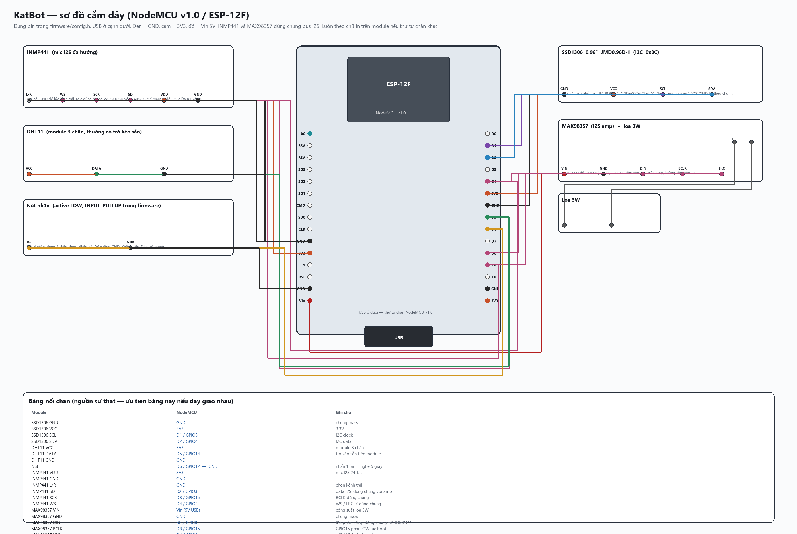

# KatBot (Mèo Bot)

Local voice chatbot on an **ESP-12F / NodeMCU**. The chip is a thin client; speech, LLM, tools, and the web monitor run on your PC so the microcontroller stays light.

[](LICENSE)
[](https://github.com/kataro92/KatBot/wiki)



Inspired by [Xiaozhi](https://github.com/78/xiaozhi-esp32) (WebSocket session, listen/speak states), but fully local via [Ollama](https://ollama.com/) (with optional [Cursor CLI](https://cursor.com/) for chat). ESP-12F is an ESP8266 — this repo does **not** port Xiaozhi firmware (no ESP-SR wake word, no Opus, no AEC).

The browser talks only to the PC. It never loads the ESP.

**Docs:** [Wiki](https://github.com/kataro92/KatBot/wiki) · [Hardware & wiring](https://github.com/kataro92/KatBot/wiki/Hardware) · [Backend](https://github.com/kataro92/KatBot/wiki/Backend) · [Firmware](https://github.com/kataro92/KatBot/wiki/Firmware) · [Protocol](https://github.com/kataro92/KatBot/wiki/Protocol)

## Status

| Stage | What | State |
| --- | --- | --- |
| 0–1 | Backend, warm LLM session, web monitor, Wi-Fi, OLED, DHT11, listen button | Done |
| 2 | TTS playback over I2S (MAX98357, 16 kHz PCM) | Done |
| 3 | Mic capture (MAX9814 → 8 kHz PCM → STT) | Done |
| 4 | Full talk loop: listen → STT → tools/LLM → TTS | Done |
| 5 | Chibi OLED UI, boot SFX, reconnect, tools (weather / FX / search / music) | Done |

## Features (current)

- Press the button once → firmware opens a **5 second** listen window (not hold-to-talk; `LISTEN_MS` in `.env` and `config.h`)
- Mic streams 8 kHz PCM to the PC; STT default is **PhoWhisper** (faster-whisper and ElevenLabs Scribe are optional)
- Chat: **Cursor CLI** (model Auto) first, **Ollama** fallback (`llama3.2` by default)
- Tools when the utterance needs them: indoor DHT11, outdoor weather, USD/VND, Wikipedia/news/web, short music clips
- TTS (gTTS, Vietnamese) plays on the MAX98357; music clips use the same I2S path
- OLED chibi cat UI with status (`idle` / `nghe` / `nghi` / `noi`) plus temperature / humidity
- Web dashboard: device online, DHT chart, listen bar, event log, text chat that also speaks on the ESP

Device states: `idle` → `listening` (timer on the chip) → `thinking` → `speaking` → `idle`. Extra presses while busy are ignored (no barge-in).

## Hardware

| Part | Role |
| --- | --- |
| ESP-12F on NodeMCU v1.0 | Wi-Fi MCU |
| SSD1306 0.96" I2C (e.g. JMD0.96D-1) | Display |
| MAX9814 | Analog mic (A0) |
| MAX98357 + 3 W speaker | I2S amp |
| DHT11 | Temperature / humidity |
| Momentary button | Listen trigger, active LOW |

No Arduino Uno coprocessor.

### Wiring



OLED JMD0.96D-1 pin order is commonly **GND–VCC–SCL–SDA**. If VCC/GND are swapped on the silkscreen, follow the PCB labels. Speaker wires go only to the MAX98357 `+` / `−` pads. Share GND. Power the amp from 5 V (`Vin`) for 3 W. Do not sample the ADC while I2S is playing.

Battery: feed **regulated 5 V into `Vin`**, not 3.7 V into `3V3`. See [Wiki → Hardware](https://github.com/kataro92/KatBot/wiki/Hardware).

### Pin map (NodeMCU labels)

| Function | Pin | GPIO | Notes |
| --- | --- | --- | --- |
| OLED SDA | D2 | 4 | Default Wire |
| OLED SCL | D1 | 5 | Default Wire |
| DHT11 | D5 | 14 | |
| Listen button | D6 | 12 | Internal pull-up, press to GND |
| MAX9814 OUT | A0 | ADC | NodeMCU divider, 0–3.3 V |
| MAX98357 BCLK | D8 | 15 | Must be LOW at boot |
| MAX98357 LRC | D4 | 2 | |
| MAX98357 DIN | RX | 3 | Native I2S data; no Serial debug |

## Repository layout

```
KatBot/
  start.bat         Start backend (venv + deps + server)
  compile.bat       Compile firmware with arduino-cli
  backend/          FastAPI (device WS, monitor WS, STT, LLM, TTS, tools)
  firmware/KatBot/  Arduino sketch for NodeMCU
  firmware/tools/   OLED sprite generator (`ref_cat.png` → `cat_bitmaps.h`)
  web/              Monitor UI (served by the backend)
  docs/             Architecture and wiring diagrams
  wiki-src/         GitHub Wiki source
  .env.example      Backend settings (no secrets)
  LICENSE           MIT
```

## Requirements

**PC:** Python 3.12+, [Ollama](https://ollama.com/) with a local model (default `llama3.2`), same LAN as the NodeMCU. Optional: Cursor CLI on PATH (used first for chat when `CURSOR_CLI_ENABLED=true`).

**Firmware:** Arduino IDE or arduino-cli, ESP8266 core, board **NodeMCU 1.0 (ESP-12E)** (`esp8266:esp8266:nodemcuv2`). Libraries: see [`firmware/libraries.txt`](firmware/libraries.txt) (Adafruit SSD1306, Adafruit GFX, DHT sensor library, Adafruit Unified Sensor, ArduinoJson, WebSockets). The WebSockets library should use a 2 KB `MAX_DATA_SIZE`.

## Quick start

### 1. Backend

Double-click [`start.bat`](start.bat) in the repo root. It creates `backend/.venv` if needed, installs missing packages, copies `.env` from `.env.example` when absent, then starts the server.

Open [http://127.0.0.1:8080](http://127.0.0.1:8080) (or `http://<pc-lan-ip>:8080`). Use the text box to confirm chat before flashing. Typed chat uses the same pipeline as the mic, including TTS on the speaker when the ESP is online.

Ollama must already be running. On startup the backend preloads the model (`keep_alive=-1`) and warms STT.

Useful env vars (repo-root `.env`):

| Variable | Default | Meaning |
| --- | --- | --- |
| `HOST` / `PORT` | `0.0.0.0` / `8080` | Bind address (`0.0.0.0` so the ESP can connect) |
| `LISTEN_MS` | `5000` | Listen window; sent to the ESP on connect |
| `OLLAMA_HOST` | `http://127.0.0.1:11434` | Ollama API |
| `OLLAMA_MODEL` | `llama3.2` | Fallback chat model |
| `OLLAMA_KEEP_ALIVE` | `-1` | Keep the model loaded |
| `OLLAMA_NUM_PREDICT` | `80` | Short replies |
| `CURSOR_CLI_ENABLED` | `true` | Prefer local Cursor CLI, then Ollama |
| `STT_ENGINE` | `phowhisper` | `phowhisper` \| `faster-whisper` \| `elevenlabs` |
| `TTS_ENGINE` | `gtts` | Vietnamese speech via gTTS |
| `WEB_SEARCH_ENABLED` | `true` | Weather / FX / Wikipedia / news / web |
| `WEATHER_CITY` | `Ha Noi` | Default city when none is named |

Do not commit `.env` or API keys. More: [Wiki → Backend](https://github.com/kataro92/KatBot/wiki/Backend).

### 2. Firmware

1. Copy [`firmware/KatBot/secrets.h.example`](firmware/KatBot/secrets.h.example) to `firmware/KatBot/secrets.h`.
2. Set `WIFI_SSID`, `WIFI_PASS`, and `WS_HOST` to this PC’s LAN IPv4. `secrets.h` is gitignored.
3. Select **NodeMCU 1.0 (ESP-12E)**, the correct COM port, 115200 baud. Or run [`compile.bat`](compile.bat).
4. Upload [`firmware/KatBot/KatBot.ino`](firmware/KatBot/KatBot.ino).
5. OLED: Wi-Fi, a short boot jingle, then idle with the cat sprite when the WebSocket is up. The dashboard should show **ESP online**.

Press the listen button once (do not hold). OLED shows `nghe` and a countdown; after 5 s it shows `nghi`, then speaks the reply. Details: [Wiki → Firmware](https://github.com/kataro92/KatBot/wiki/Firmware).

## Protocol (device ↔ backend)

WebSocket: `ws://<pc>:8080/ws/device`

Text JSON (Xiaozhi-like) plus raw PCM binary frames (not Opus):

- Device `hello` / `listen` (`start` \| `stop`) / `telemetry` / `abort`
- Uplink binary: 8 kHz 16-bit mono PCM while listening
- Server `hello` (includes `session_id`, `listen_ms`) / `config` / `state` / `tts` (`start`, `sentence_start`, `stop`)
- Downlink binary: 16 kHz 16-bit mono PCM while speaking

Monitors use `ws://<pc>:8080/ws/monitor` and only receive fan-out events. See [Wiki → Protocol](https://github.com/kataro92/KatBot/wiki/Protocol).

## Security

- Do not commit `.env` or `firmware/KatBot/secrets.h`.
- Bind the backend to your LAN only; there is no auth on the WebSockets yet.
- Rotate any API keys copied from older projects. They are optional (ElevenLabs STT, Google CSE).

## Author

[Phạm Huy Đức](mailto:kataro92@gmail.com)

## License

[MIT](LICENSE) © 2026 Phạm Huy Đức

## Acknowledgments

- [78/xiaozhi-esp32](https://github.com/78/xiaozhi-esp32) for the session/transport ideas
- [Ollama](https://ollama.com/) for local LLM serving
